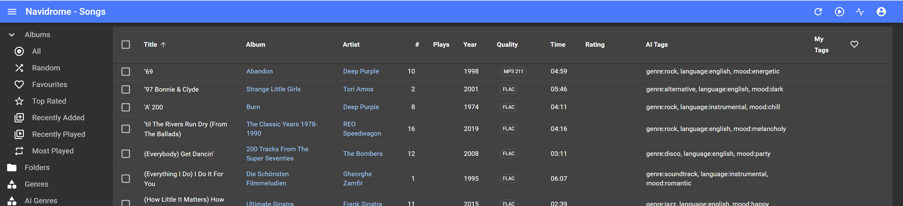
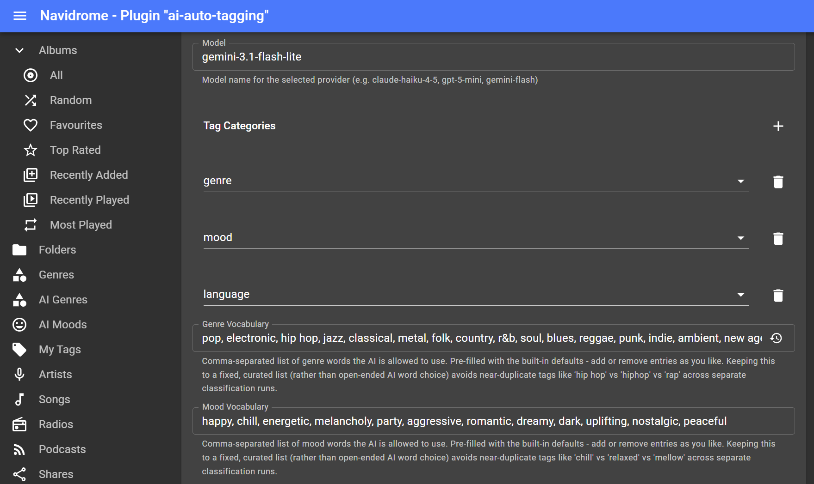
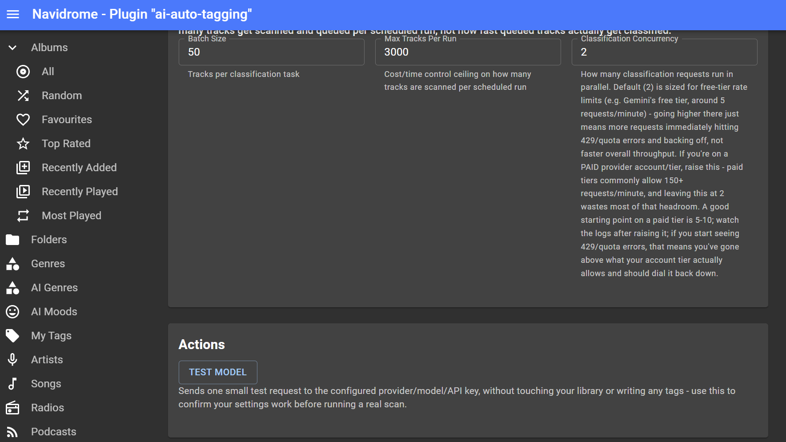

# AI Auto-Tagging Plugin for Navidrome

> ⚠️ **Requires [navidrome-experimental](https://github.com/RFLundgren/navidrome_experimental)** — this plugin
> **will not work** on stock/upstream Navidrome. It depends on Subsonic endpoints
> (`setUserTag.view`/`getUserTags.view`/`getAllUserTags.view`/`getSongsByUserTag.view`) that only exist in this
> personal fork, not in Navidrome itself. If you're not already running `navidrome-experimental`, install/switch to
> it first — see that repo's README for how to get it — before installing this plugin.

A [Navidrome](https://www.navidrome.org/) plugin that auto-classifies tracks (genre, mood, language) using an AI
provider (Anthropic, OpenAI, or Gemini), so a whole library becomes filterable by AI-suggested tags instead of
relying on manually maintained playlists per genre/language. A companion project,
[AI Mood Playlists](https://github.com/RFLundgren/AI-Mood-Playlists-Plugin), builds and maintains actual playlists from
these tags automatically — one per discovered genre/mood value — if you want that on top of just the tags
themselves.

Built against [navidrome-experimental](https://github.com/RFLundgren/navidrome_experimental) (a personal fork of
Navidrome), using its `media_file_tag` user-tagging feature via three Subsonic endpoints this project added there
(`setUserTag.view`, `removeUserTag.view`, `getUserTags.view`). See [PLAN.md](PLAN.md) for the full design and build
plan.

## Status

**Working, tested end-to-end in production** against a real Navidrome instance. The prerequisite endpoints are
merged into `navidrome-experimental`. Live-tested against Gemini; the Anthropic and OpenAI adapters share the same
`Classify()` interface and are covered by unit tests, but haven't yet been live-verified against a real account.

Tags are written under a single identity (Option C in PLAN.md — private, simplest to reason about). The
shared/broadcast visibility options (A/B) remain a deliberate future decision, not yet implemented.

## How it works

1. On a configurable schedule, the plugin pages through the library via `search3`, picking up where the last run
   left off.
2. Each track is checked for existing tags first (`getUserTags.view`) — **a track is only ever classified once.**
   Once it has any tag, every future scan skips it. The only recurring cost is a cheap, local, free Navidrome API
   check per track, not a repeated AI call.
3. Untagged tracks are batched and handed to the configured AI provider, which returns suggested tags per category
   (genre/mood/language), prefixed to avoid collisions in the shared freeform tag namespace (e.g. `genre:rock`,
   `mood:energetic`, `language:english`). `genre` and `mood` are constrained to a fixed, curated vocabulary (25
   genres, 12 moods — see `genreVocabulary`/`moodVocabulary` in `providers.go`), with anything the model returns
   outside that list silently dropped. `language` stays open-vocabulary on purpose, since it should reflect the
   track's actual language rather than a curated list. The vocabulary constraint exists specifically so
   [AI Mood Playlists](https://github.com/RFLundgren/AI-Mood-Playlists-Plugin)' one-playlist-per-tag-value approach
   doesn't fragment into near-duplicates (`chill`/`relaxed`/`mellow` for the same idea).
4. Tags are written back via `setUserTag.view`.

Tags this plugin writes show up under Navidrome's **AI Tags** column in the Songs list (a separate column from
**My Tags**, which is for a person's own hand-added tags — see `navidrome-experimental`'s README for that
distinction). They're read-only from the Songs list UI: there's no button there to manually add/remove an
individual AI Tag on a song. If you want to change which words end up as AI Tags, that happens in this plugin's
own config (**Genre Vocabulary**/**Mood Vocabulary**, see below), not in the Navidrome UI.

`navidrome-experimental` also has **AI Genre** and **AI Mood** sidebar dashboards — chip-grid pages built directly
from the tags this plugin writes, one chip per distinct value, each linking to a page of every song carrying it
plus a "Create Playlist" action. See that repo's README for details; nothing in this plugin needs configuring
differently to use them; they just read whatever this plugin has already written.

<p align="left">
    
</p>

## Customizing the genre/mood vocabulary

The **Genre Vocabulary** and **Mood Vocabulary** config fields control the fixed word list the AI is allowed to
choose from for those two categories (see the vocabulary-constraint explanation above). Each is a plain
comma-separated text box, and both come pre-filled with the built-in defaults when you first open the config
screen — so editing means trimming down or adding to existing text, not typing a list from scratch.

For example, the Genre Vocabulary field starts as:

```
rock, pop, electronic, hip hop, jazz, classical, metal, folk, country, r&b, soul, blues, reggae, punk, indie, ambient, new age, world, funk, disco, house, techno, alternative, soundtrack, experimental
```

To add `trance` and remove `soundtrack` and `experimental` (say your library has none of those), edit the field
to read:

```
rock, pop, electronic, hip hop, jazz, classical, metal, folk, country, r&b, soul, blues, reggae, punk, indie, ambient, new age, world, funk, disco, house, techno, alternative, trance
```

Anything you add here becomes a value the AI is *allowed* to use going forward — it doesn't retroactively
re-tag anything already classified, and it doesn't force the AI to use it either (it only picks from the list
what actually fits a track). The Mood Vocabulary field works the same way, starting from:

```
happy, chill, energetic, melancholy, party, aggressive, romantic, dreamy, dark, uplifting, nostalgic, peaceful
```

Keep both lists reasonably short and free of near-duplicates (`chill` and `relaxed` meaning the same thing, say)
— that's the entire point of constraining the vocabulary in the first place. If you use
[AI Mood Playlists](https://github.com/RFLundgren/AI-Mood-Playlists-Plugin), whatever you configure here is exactly the
set of genre/mood playlists it can build, so keep the two plugins' expectations in sync (that plugin's own
allowlist fields are pre-filled with this same default list, and only need editing if you've customized this
field too).

**Lost track of the original list after editing it down?** Both fields show a small ↺ (restore) icon at the
right edge whenever their current value differs from the built-in default — click it to snap the field straight
back to the full default list shown above, no need to retype or copy-paste it from this README. It only appears
once you've actually changed the field from its default, and only restores that one field, not your whole config.
(Requires a recent enough `navidrome-experimental` — this button needs its on-demand config-field-reset support.)

<p align="left">
    
</p>

## Testing your setup before a real scan

Once you've entered a **Provider**, **API Key**, and **Model**, hit **Save** on the config page first (this
reloads the plugin with your new settings), then look for a **Test Model** button in an **Actions** section
further down the same page — this requires `navidrome-experimental`'s on-demand plugin actions feature, see that
repo's README for the general mechanism.

Clicking it sends **one small request** to your configured provider/model/API key — it does not scan your
library, does not read any real tracks, and does not write any tags. It exists specifically so you can catch a
typo'd API key or a wrong model name before committing to a real scan across potentially thousands of tracks (and
real provider cost).

- **Success** looks like: `OK - anthropic/claude-haiku-4-5 responded in 842ms (test tags: [genre:rock])` — the
  provider name/model you configured, how long the round trip took, and whatever tag(s) it assigned to a made-up
  test track (the actual tag value doesn't matter here; a real response coming back at all is the point).
- **Failure** shows the provider's own error text, e.g. an authentication error for a bad API key, or a "model not
  found" error for a model name your provider doesn't recognize — the same error a real scan would eventually hit,
  just surfaced immediately instead of after enqueuing a batch of real tracks.

<p align="left">
    
</p>

If the button doesn't appear at all: the plugin needs to be **enabled** (not just configured) for its actions to
run - and if it's still missing after that, your Navidrome instance may be on a version of `navidrome-experimental`
from before this feature existed; update it.

## Cost & AI provider responsibility

This plugin calls a third-party AI provider (Anthropic, OpenAI, or Gemini) directly using **your own API key**,
configured in the plugin's settings. **You are solely responsible for any usage charges your provider bills to that
key.** Neither this plugin nor Navidrome imposes a spending cap — manage that on the provider's side (Anthropic
Console, OpenAI's usage dashboard, Google AI Studio / Cloud billing).

Before running this against a large library:

- Check your provider's current pricing for whatever model you've configured — this changes often enough that any
  number quoted here would go stale.
- Consider a budget alert or hard spending cap in your provider's billing dashboard, if it offers one.
- Test with a small `maxTracksPerRun` first to confirm cost and tag quality before scanning your whole library.
- Free-tier API keys often have very low requests-per-minute limits (e.g. 5/min has been observed on Gemini's free
  tier) — if classification seems to crawl or fail with `429`/quota errors, that's the likely cause, not a bug. The
  task queue's retry backoff is tuned for roughly a 60-second provider rate-limit window.

## Speeding up classification on a paid account

Three settings together control how fast your library gets tagged: **Batch Size**, **Max Tracks Per Run**, and
**Classification Concurrency**. The defaults are all sized around a free-tier provider account, where going faster
than the provider allows just means more requests immediately failing with `429`/quota errors and retrying — not
actually finishing sooner.

**If you're on a paid provider account/tier, the setting that actually matters is Classification Concurrency**
(default `2`) — this is how many classification requests run at the same time. Free-tier rate limits (e.g.
Gemini's free tier at roughly 5 requests/minute) mean 2 concurrent requests is already close to the ceiling, so
raising it wouldn't help there. Paid tiers commonly allow 150+ requests/minute — comfortably enough headroom that
concurrency, not the provider's rate limit, becomes the actual bottleneck. For a rough sense of scale: 15,000
tracks at the default Batch Size (50) is 300 classification calls; at concurrency 2 that's roughly 150 sequential
rounds of API latency, but at concurrency 8-10 it's roughly 30-40 rounds — several times faster, and still nowhere
near a typical paid tier's rate limit.

To raise it: set **Classification Concurrency** to something like `5`–`10` as a starting point, save, and watch
the plugin's logs during a scan. If you start seeing `429`/quota errors again, that means you've gone above what
your account tier actually allows — dial it back down until they stop. There's no way to know the exact right
number ahead of time without checking your specific provider account's rate limits (for Gemini, see
[aistudio.google.com/rate-limit](https://aistudio.google.com/rate-limit)), so treat this as "raise, watch the
logs, adjust" rather than a one-shot setting.

`maxTracksPerRun` and `batchSize` are a separate concern from concurrency — they control how many tracks get
*scanned and queued* per scheduled run, not how fast already-queued tracks get classified. Raising concurrency is
what actually speeds up classification itself.

## Sizing `cron` and `maxTracksPerRun`

These two settings answer a different question from concurrency above: not "how fast does classification run"
but "how often does the plugin look for new untagged tracks, and how many does it pick up each time." The right
values depend on which phase you're in.

**Initial backfill** (first time running this against an existing library): the scan step itself is cheap — it's
just local `getUserTags.view` calls, no AI provider involved — so there's no downside to running it often. A
reasonable starting point:

- `cron`: `*/30 * * * *` (every 30 minutes)
- `maxTracksPerRun`: `2000`

At those settings, a ~15,000-track library clears in about 8 runs (roughly 4 hours). I don't have hard timing
data on exactly how many tracks fit in the scheduler's execution window (each run needs to finish quickly — it's
just enqueuing, not waiting for classification), so treat `2000` as a starting point, not a guarantee: watch the
logs for `"scan complete - N track(s) scanned, M enqueued"` after a run or two. If that line shows up consistently
with the full count you configured, it's comfortably finishing in time and you can raise it further to clear the
backlog in fewer runs; if it never seems to be scanning as many as expected, dial it down.

It's safe to experiment here — the plugin tracks a high-water mark (an offset in its KV store) between runs, so
even a run that gets cut off partway through doesn't lose or double-process anything; the next run just resumes
exactly where the last one left off.

**Steady state** (library's mostly tagged, just catching new additions): there's no reason to keep scanning every
30 minutes once nothing new is being found. Switch back to something like the default:

- `cron`: `0 3 * * *` (once daily) — or `0 */6 * * *` (every 6 hours) if you add music often enough that daily
  feels slow
- `maxTracksPerRun`: back down to something modest like `500` (the default) — new tracks trickle in far slower
  than an initial backfill needs to clear

## Configuration

Set via Navidrome's Admin → Plugins → AI Auto-Tagging → Config, after installing the `.ndp` package:

| Field | Notes |
|---|---|
| `provider` | `anthropic`, `openai`, or `gemini` |
| `apiKey` | The selected provider's API key |
| `model` | Model name for the selected provider — verify the exact ID against your provider's current model list |
| `tagCategories` | Which categories to suggest: any of `genre`, `mood`, `language`. If you're not using [AI Mood Playlists](https://github.com/RFLundgren/AI-Mood-Playlists-Plugin) or otherwise don't need language tags, set this to just `genre, mood` — the manifest default includes `language` for anyone installing fresh, but it's a config-only change, no code involved, and won't automatically drop tags already written (see `PLAN.md` for a one-time cleanup approach if you're changing this after already tagging a library) |
| `genreVocabulary` / `moodVocabulary` | Comma-separated, pre-filled with the built-in defaults — edit down or add to customize which genre/mood words the AI is allowed to use. See **Customizing the genre/mood vocabulary** above |
| `libraryUser` | Username whose library view is used to read tracks and read/write tags |
| `cron` | Cron expression for how often to scan for untagged tracks |
| `batchSize` | Tracks per classification API call |
| `maxTracksPerRun` | Ceiling on how many tracks are scanned per scheduled run |
| `classifyConcurrency` | How many classification requests run in parallel (default `2`, sized for free-tier rate limits). Raise this on a paid provider account/tier — see **Speeding up classification on a paid account** above |

The plugin also needs the **Users Permission** grant (Admin → Plugins → AI Auto-Tagging) for whichever user matches
`libraryUser`, since it authenticates its Subsonic calls as that account.

## Relationship to navidrome-experimental

This is a **separate project**, deliberately not built inside the `navidrome-experimental` repo or its
`plugins/examples/` folder (which is teaching material for the plugin system, not a home for real production
plugins). It only talks to Navidrome through the plugin API — it doesn't need to *be* Navidrome, the same way the
[Cirque](https://github.com/RFLundgren/navidrome_experimental/discussions/15) client and the Pulse companion app
are separate projects from the server they talk to.

That said, this plugin has a real dependency on `navidrome-experimental`: it can't write tags without the
`setUserTag`/`removeUserTag`/`getUserTags` endpoints this project added there. Track further core-fork work in
`navidrome-experimental`'s own
[FEATURE_ROADMAP.md](https://github.com/RFLundgren/navidrome_experimental/blob/master/FEATURE_ROADMAP.md), not here.

## Building

```bash
tinygo build -o plugin.wasm -target wasip1 -buildmode=c-shared .
```

Package into a `.ndp` (the wasm file must be named exactly `plugin.wasm` inside the zip):

```powershell
# Windows
Compress-Archive -Path manifest.json,plugin.wasm -DestinationPath ai-auto-tagging.zip
Rename-Item ai-auto-tagging.zip ai-auto-tagging.ndp
```

```bash
# Linux/macOS
zip -j ai-auto-tagging.ndp manifest.json plugin.wasm
```

Run tests (no TinyGo/WASM runtime needed — the PDK provides mocks for native builds):

```bash
go test ./...
```

See [Navidrome's plugin system docs](https://github.com/navidrome/navidrome/tree/master/plugins) for the general
mechanics (manifest format, permissions, host services, testing with the Extism CLI) — this project only documents
what's specific to *this* plugin here and in [PLAN.md](PLAN.md).

## License

TBD.
